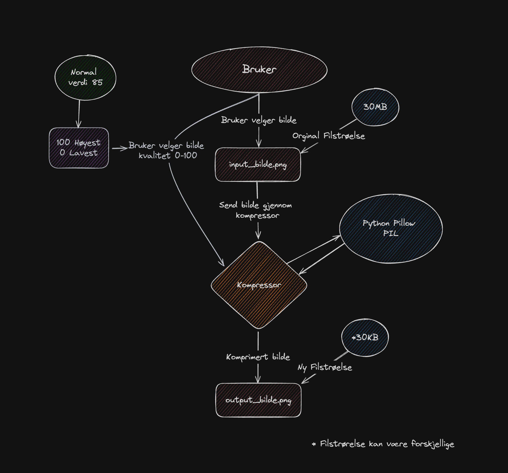

# PixelPerfect

## Hva er PixelPerfect?
PixelPerfect er et Python program som kan komprimere bilder. Programmet kan komprimere bilder i formatene .jpg, .jpeg, .png og. Programmet kan også konvertere bilder til .jpg, .jpeg, .png.

## Hvordan bruke PixelPerfect?
Å bruke PixelPerfect er veldig enkelt. Alt du trenger å gjøre er å kjøre `python3 main.py` filen og følge instruksjonene. Du må også ha et bilde du kan komprimere.

## Hvordan funker PixelPerfect?
PixelPerfect funker ved å bruke Pillow bibloteket. Pillow er et biblotek som lar deg åpne, manipulere og lagre bilder i mange forskjellige formater.

## Eksempel
https://youtu.be/KyQlv3WWnjY